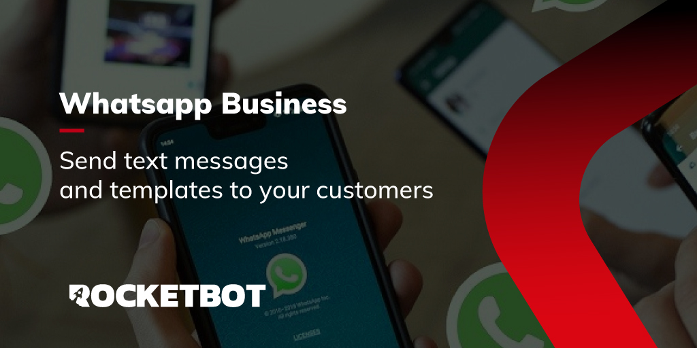

# Whatsapp Business
  
Module to connect with Whatsapp Business api and send text or template messages

*Read this in other languages: [English](Manual_WhatsappBusiness.md), [Español](Manual_WhatsappBusiness.es.md), [Português](Manual_WhatsappBusiness.pr.md)*
  

## How to install this module
  
The installation can be:
1. Manual: __Download__ the .zip file and unzip it in the modules folder. The folder name must be the same as the module name and inside it must have the following files and folders: \__init__.py, package.json, docs, example and libs. If you have the application open, refresh the browser to be able to use the new module.
2. Automatic: When entering Rocketbot Studio on the right margin you will find the **Addons** section, select **Install Mods**, search for the desired module and press install.  

## How to use this module
To use this module, you must perform the following configuration:
1. __Log in__ or __register__ at https://developers.facebook.com/
2. Go to your Apps at https://developers.facebook.com/apps/
3. Create a new App. It must be a Business App. On the next page, choose the name, the administrator's email and the Business Account to which the App will be linked.
4. When creating the App, you will be redirected to the App page, which will be in Development mode. On this page, select in the Whatsapp app the __Configure__ button and then __API Configuration__. When you click Continue, you will be given a test number to send messages and up to 5 contacts that you can add to receive the test messages.
5. On the Quick Start page, click __Start using the API__. 
6. In both the development and production App, you can only send messages that include text to conversations that have been initiated by the user. If the conversation is initiated by the company, you must send templates that have been approved by META. For more information check the following link: https://developers.facebook.com/docs/whatsapp/api/messages/message-templates
7. On the Getting Started page, you will see a temporary access token to use the API. This token lasts for 24 hours. If you want to use the API for a longer period of time, you must request a permanent access token (See point 12).
8. In this section you will have access to the Whatsapp test number and recipient number settings. You also have the phone number identifier. Both this data and the token will be required to connect through the module in developer mode.
9. Try to associate a recipient and send from the module the default hello_world template with the en_US language. If everything works correctly, you will receive a Whatsapp message with the text "Hello World!".
10. Once you have checked the operation, you can create your own templates that need to be approved by META and send them through the module. For more information about the templates, check the following link: https://developers.facebook.com/docs/whatsapp/api/messages/message-templates
11. Once you have tested the API functionality, you will need to add a phone number of your company to be able to send messages to your customers. Click on the button in step 5 __Add phone number__ and follow the steps to create the Whatsapp Business profile. Once added, save the phone number identifier, this data will be necessary to be able to connect through the module.
12. Once you have a phone number added, it remains to configure the application to switch to productive mode and generate a permanent access token. To do this, go to the App page at https://developers.facebook.com/apps/ and select the App you created. On the App page, select the "Configure" button in the Whatsapp app and then "Basic Settings".
13. There you must provide a __Privacy Policy URL__ as mandatory and the rest of the fields as optional. At the end click on __Save changes__.
14. With everything configured, the app is ready to go to Active mode. To do this go to the top of the web and move the Development selector to Active. 
15. Get a permanent token: To do this you must have a Meta trading account. Go to https://business.facebook.com/ and in the left menu select your company, and click on the configuration wheel, then Business Settings. In the new window click on System users and add a new one.
16. Accept the message in the window that opens and then select a name for your new user. Under Role you should put Administrator.
17. When creating the user click on the __Add assets__ button. In the window that will open select Apps, then check the App you created and activate the option __Manage App__, then Save the changes.
18. When assigning the asset, click on __Generate new token__. Select your App and check all permissions from the list (They are not all required but if more integrations are added to Rocketbot in the future you will be able to use the same token). Click on __Generate token__. This will be the permanent token that you will be able to use to authenticate in the module.

## Description of the commands

### Configure server
  
Configure the Whatsapp API to be able to execute commands
|Parameters|Description|example|
| --- | --- | --- |
|API KEY|API KEY obtained in https//developers.facebook.com/|api-key|
|Phone number identifier|Phone number identifier obtained in https//developers.facebook.com/|116787907958900|
|Assign result to a variable|Variable where the result will be saved|Variable|

### Send text message or template
  
Sends a text message or from a template to a Whatsapp number
|Parameters|Description|example|
| --- | --- | --- |
|Whatsapp number|Whatsapp number to which the message will be sent|5551112222|
|Template and language code|Message template and language code that will be sent to the Whatsapp number.|hello_world, en_US|
|Message|Message that will be sent to the Whatsapp number|Hello, how are you?|
|Assign result to a variable|Variable where the result will be saved|Variable|
